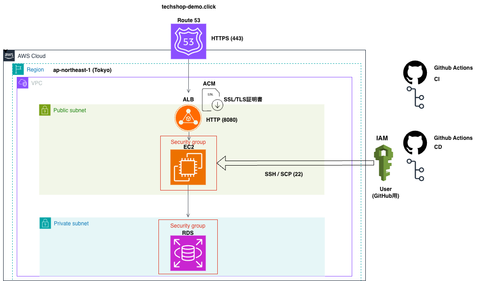

# EC-Shop Project (Spring Boot + Docker Template / AWS + GraphQL)

このリポジトリは、Docker環境（Java/MySQL/Nginx）で動作する本格的なECサイト（電子商取引）開発用テンプレート、およびAWS上に構築した冗長性とセキュリティを兼ね備えた本番インフラ環境のプロジェクトです。
単純なCRUDアプリから、ユーザー・管理者の権限管理を含む実用的なWebアプリケーションへの拡張、および実務を見据えたモダンなCI/CDパイプラインを構築しています。

### 🌐 本番稼働デモURL
* **APIエンドポイント**: `https://techshop-demo.click/graphql`
* **GraphQL Playground**: `https://techshop-demo.click/graphql` （ブラウザから直接クエリを検証可能です）

---

## 🏗️ システムアーキテクチャ図 (AWS Production Infrastructure)

本番環境のクラウドインフラ構成およびデプロイフローの全体図です。パブリック・プライベートサブネットを明確に分けた多層防御ネットワークと、GitHub Actionsによる安全な自動化を実現しています。



---

## 🛠️ 技術スタック (Technical Stack)

### バックエンド / データベース
* **Java (11+) / Spring Boot**: 堅牢なオブジェクト指向開発の実践
* **GraphQL (Spring for GraphQL)**: クライアント駆動な効率的データ取得
* **Spring Data JPA / MySQL**: 永続化、リレーショナルデータベースによる厳格なデータ管理

### インフラ・クラウド（AWS本番環境）
* **Amazon EC2**: アプリケーションサーバーのホスティング
* **Application Load Balancer (ALB)**: SSL終端および将来的なトラフィック分散の集約点
* **Amazon Route 53**: 独自ドメイン（`techshop-demo.click`）のDNSルーティング管理
* **AWS Certificate Manager (ACM)**: インターネット通信の完全HTTPS化（SSL/TLS証明書管理）
* **Amazon VPC**: Public/Privateサブネットによる多層防御ネットワークの構築

### CI/CD・開発環境
* **GitHub Actions**: 継続的インテグレーション（CI）および自動デプロイ（CD）の自動化
* **Docker / Docker Compose**: ローカル開発環境のコンテナ化（Java/MySQL/Nginx）

---

## 🧠 技術選定・インフラ設計の理由

### 1. なぜ REST ではなく「GraphQL」なのか？
ECサイトのように「商品詳細、レビュー、関連商品、在庫状況」など、画面やデバイス（Web/モバイル）によって必要なデータ量が大きく変動するシステムにおいて、REST API特受の **Over-fetching（不要なデータの取得）** や **Under-fetching（複数回リクエストの発生）** を解決するために採用しました。フロントエンド側が必要なフィールドのみを指定して一括取得できるため、無駄な通信を削減し、高速な画面レンダリングを可能にします。

### 2. なぜコンテナ等を使わず「AWSへ直接デプロイ」したのか？
クラウドインフラの基礎となる **ネットワーク（VPC、サブネット、ルーティング）**、**セキュリティ（セキュリティグループ、IAMユーザー権限）**、および **OSレイヤー（Linux/EC2）の設定・トラブルシューティング能力** を完全に手を動かして証明するために、あえて抽象化度の高いマネージドサービス（ECS/Fargateなど）を使わず、EC2/ALBを中心としたIaaS主体の構成を選択しました。これにより、AWSのコアサービスがどのように連携して通信を制御しているかを深く理解・実装しました。

### 3. CI/CD パイプラインによる自動化
GitHub Actionsを活用し、メインブランチへのマージをトリガーに自動デプロイが起動。最小限の権限に絞って設定した **AWS IAM User** の認証を安全に通過し、**SSH / SCP (22番ポート)** 経由で本番EC2環境へ新規jarファイルを自動転送・アプリケーションの再起動を行う仕組みを構築し、安全かつ迅速なリリースフローを担保しています。

### 4. インフラセキュリティのこだわり
* **SSL終端による多層防御**: インターネットから ALB までは ACM で管理された `HTTPS (443)` で暗号化通信を受け止め、VPC内部（ALB ➔ EC2）は内部ポート `HTTP (8080)` で高速転送する実務標準の構成をとっています。
* **データベースの隠蔽**: MySQL(Amazon RDS)は外部から隔離された `Private subnet` に配置し、EC2のセキュリティグループからのみ接続を許可するホワイトリスト形式で完全に保護しています。

---

## 🚀 プロジェクトの目的
現在、基本的な商品管理機能（CRUD）をベースに、以下のECサイト機能の実装を進めています。
* **ユーザー機能**: 商品閲覧、カート投入、非同期「お気に入り」登録（Ajax実装済み）。
* **管理者機能**: 商品登録・編集・在庫管理。
* **認証・認可**: Spring Securityおよび**GraphQL**を用いた「ユーザー/管理者」のログイン切り替え。

## 🏗 システム構成図 (Architecture)
* **Frontend**: Thymeleaf, JavaScript (Ajax/Fetch API)
* **API Layer**: **GraphQL (Spring for GraphQL)**
* **Backend**: Spring Boot (Java 11+), Spring Data JPA
* **Database**: MySQL (永続化ボリューム設定済み)
* **Infrastructure**: Docker Compose, Nginx (Reverse Proxy)

## 🚀 GraphQL 採用による設計の変化
本プロジェクトでは REST 従来の 「リソースごとに Controller を作る設計」から脱却 し、GraphQL の 「Resolver（リゾルバ）によるデータ集約型設計」 を採用しています。
* 単一エンドポイント: 全リクエストを /graphql で受理。
* 柔軟なデータ取得: フロントエンド側で必要なフィールドのみを指定し、オーバーフェッチを防止。
* 型安全: Schema（.graphqls）による厳格な型定義。

---

## 📡 GraphQLによる認証実装 (U-AUTH-01)
本プロジェクトでは、ログイン処理にGraphQL Mutationを採用し、フロントエンドとバックエンド間の非同期認証を実現しています。

### **実装フロー (Data Flow)**
1.  **Schema定義**: `src/main/resources/graphql/schema.graphqls` にて `login` Mutationを定義。
2.  **Request**: `login.html` のJavaScriptから `/graphql` へ `mutation` リクエストをPOST送信。
3.  **Resolver**: `AccountResolver.java` がリクエストを受け取り、Service層へ橋渡し。
4.  **Service**: `AccountService.java` がDBからユーザーを取得し、パスワード照合を実行。
5.  **Repository**: `UserRepository.java` を介してMySQLへアクセス。
6.  **Response**: 認証結果（トークン等）を `Payload.java` (DTO) に格納して返却。


### **主要な関連ファイル構成**
| レイヤー | ファイルパス | 役割 |
| :--- | :--- | :--- |
| **Schema** | `src/main/resources/graphql/schema.graphqls` | APIの型定義（Mutation/Query） |
| **Resolver** | `com.example.demo.resolvers.AccountResolver.java` | GraphQLリクエストのエントリポイント |
| **Service** | `com.example.demo.services.AccountService.java` | 認証ロジック、パスワード検証の実行 |
| **Repository** | `com.example.demo.repositries.UserRepository.java` | `UserEntity` を介したDBアクセス |
| **DTO** | `com.example.demo.dto.Payload.java` | クライアントへのレスポンス用オブジェクト |

---

## 🛠 実装予定の機能 (Roadmap)
### 1. 認証機能 (Auth)
* Spring Securityを導入し、`login.html` を作成。
* GraphQLと統合し、ユーザーロール（USER / ADMIN）によるアクセス制御。

### 2. 管理者向け画面 (Admin Dashboard)
* `/admin/**` パスの保護。
* 商品の一括管理、売上確認用ダッシュボードの構築。

### 3. ユーザー向け画面 (User Portal)
* 商品一覧および詳細表示。
* カート機能（Session管理）。
* 購入履歴の表示。

## 📋 セットアップ手順
### 1. 起動方法
docker フォルダへ移動し、ビルドと起動を行います。
```bash
cd docker
docker-compose up -d --build
```

---

## 📄 設計書

### 概要

| ドキュメント | リンク |
|---|---|
| API設計書 | [開く](https://docs.google.com/spreadsheets/d/e/2PACX-1vTU1PbsjCDuRHhcvXMfrk272WkEcpwgdXkt6ZVyRHQN79HNEVZQXpuTdjl5huI_fEw9vpnlNHsv9OFh/pubhtml?gid=399766951&single=true) |
| テーブル設計書 | [開く](https://docs.google.com/spreadsheets/d/e/2PACX-1vTU1PbsjCDuRHhcvXMfrk272WkEcpwgdXkt6ZVyRHQN79HNEVZQXpuTdjl5huI_fEw9vpnlNHsv9OFh/pubhtml?gid=1715944819&single=true) |

### 認証機能 (Auth)

| ID | リンク |
|---|---|
| U-AUTH-01 | [開く](https://docs.google.com/spreadsheets/d/e/2PACX-1vTU1PbsjCDuRHhcvXMfrk272WkEcpwgdXkt6ZVyRHQN79HNEVZQXpuTdjl5huI_fEw9vpnlNHsv9OFh/pubhtml?gid=2073395594&single=true) |
| GQL-AUTH-01 | [開く](https://docs.google.com/spreadsheets/d/e/2PACX-1vTU1PbsjCDuRHhcvXMfrk272WkEcpwgdXkt6ZVyRHQN79HNEVZQXpuTdjl5huI_fEw9vpnlNHsv9OFh/pubhtml?gid=2110589985&single=true) |
| U-AUTH-02 | [開く](https://docs.google.com/spreadsheets/d/e/2PACX-1vTU1PbsjCDuRHhcvXMfrk272WkEcpwgdXkt6ZVyRHQN79HNEVZQXpuTdjl5huI_fEw9vpnlNHsv9OFh/pubhtml?gid=1267559647&single=true) |
| GQL-AUTH-02 | [開く](https://docs.google.com/spreadsheets/d/e/2PACX-1vTU1PbsjCDuRHhcvXMfrk272WkEcpwgdXkt6ZVyRHQN79HNEVZQXpuTdjl5huI_fEw9vpnlNHsv9OFh/pubhtml?gid=1792508397&single=true) |
| U-AUTH-03 | [開く](https://docs.google.com/spreadsheets/d/e/2PACX-1vTU1PbsjCDuRHhcvXMfrk272WkEcpwgdXkt6ZVyRHQN79HNEVZQXpuTdjl5huI_fEw9vpnlNHsv9OFh/pubhtml?gid=1647465993&single=true) |
| GQL-AUTH-03 | [開く](https://docs.google.com/spreadsheets/d/e/2PACX-1vTU1PbsjCDuRHhcvXMfrk272WkEcpwgdXkt6ZVyRHQN79HNEVZQXpuTdjl5huI_fEw9vpnlNHsv9OFh/pubhtml?gid=264587808&single=true) |
| U-AUTH-04 | [開く](https://docs.google.com/spreadsheets/d/e/2PACX-1vTU1PbsjCDuRHhcvXMfrk272WkEcpwgdXkt6ZVyRHQN79HNEVZQXpuTdjl5huI_fEw9vpnlNHsv9OFh/pubhtml?gid=843175570&single=true) |
| GQL-AUTH-04 | [開く](https://docs.google.com/spreadsheets/d/e/2PACX-1vTU1PbsjCDuRHhcvXMfrk272WkEcpwgdXkt6ZVyRHQN79HNEVZQXpuTdjl5huI_fEw9vpnlNHsv9OFh/pubhtml?gid=1324166686&single=true) |
| U-AUTH-05 | [開く](https://docs.google.com/spreadsheets/d/e/2PACX-1vTU1PbsjCDuRHhcvXMfrk272WkEcpwgdXkt6ZVyRHQN79HNEVZQXpuTdjl5huI_fEw9vpnlNHsv9OFh/pubhtml?gid=109669780&single=true) |
| GQL-AUTH-05 | [開く](https://docs.google.com/spreadsheets/d/e/2PACX-1vTU1PbsjCDuRHhcvXMfrk272WkEcpwgdXkt6ZVyRHQN79HNEVZQXpuTdjl5huI_fEw9vpnlNHsv9OFh/pubhtml?gid=1507221397&single=true) |
| U-AUTH-06 | [開く](https://docs.google.com/spreadsheets/d/e/2PACX-1vTU1PbsjCDuRHhcvXMfrk272WkEcpwgdXkt6ZVyRHQN79HNEVZQXpuTdjl5huI_fEw9vpnlNHsv9OFh/pubhtml?gid=980873209&single=true) |
| GQL-AUTH-06 | [開く](https://docs.google.com/spreadsheets/d/e/2PACX-1vTU1PbsjCDuRHhcvXMfrk272WkEcpwgdXkt6ZVyRHQN79HNEVZQXpuTdjl5huI_fEw9vpnlNHsv9OFh/pubhtml?gid=323420372&single=true) |
| U-AUTH-07 | [開く](https://docs.google.com/spreadsheets/d/e/2PACX-1vTU1PbsjCDuRHhcvXMfrk272WkEcpwgdXkt6ZVyRHQN79HNEVZQXpuTdjl5huI_fEw9vpnlNHsv9OFh/pubhtml?gid=592837783&single=true) |
| GQL-AUTH-07 | [開く](https://docs.google.com/spreadsheets/d/e/2PACX-1vTU1PbsjCDuRHhcvXMfrk272WkEcpwgdXkt6ZVyRHQN79HNEVZQXpuTdjl5huI_fEw9vpnlNHsv9OFh/pubhtml?gid=1719348868&single=true) |
